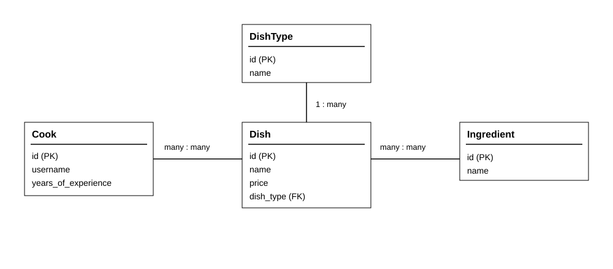

# Restaurant Kitchen Service

A simple Django website for managing a restaurant kitchen.

## Features

- cooks, dishes and dish types management
- ingredients as an optional feature
- login and logout
- search and pagination
- assigning cooks to dishes

## Database diagram

## Deployed

- Link: https://restaurant-kitchen-service-adsv.onrender.com/
- Login: barista
- Password: 1357qwer
